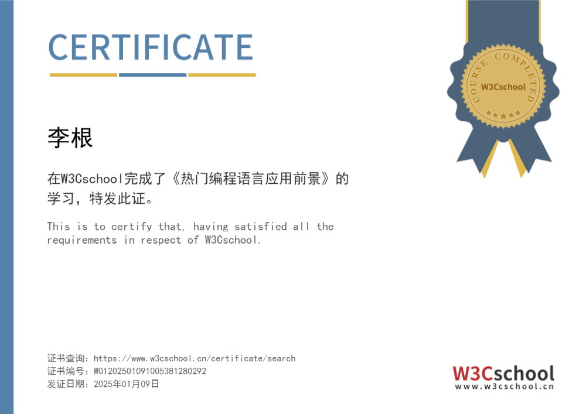
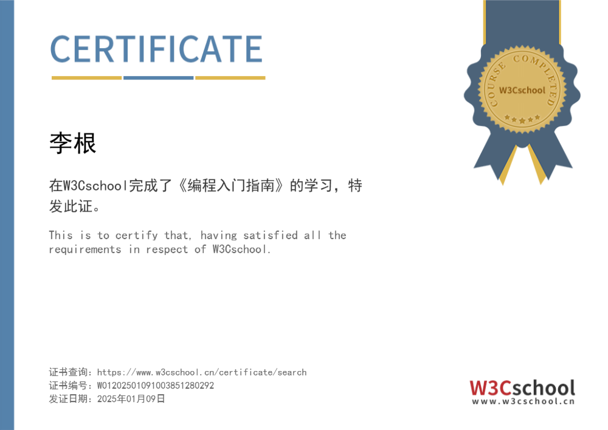
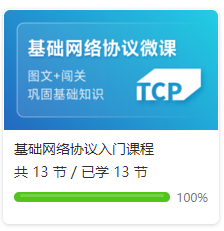
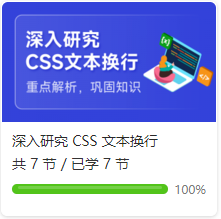
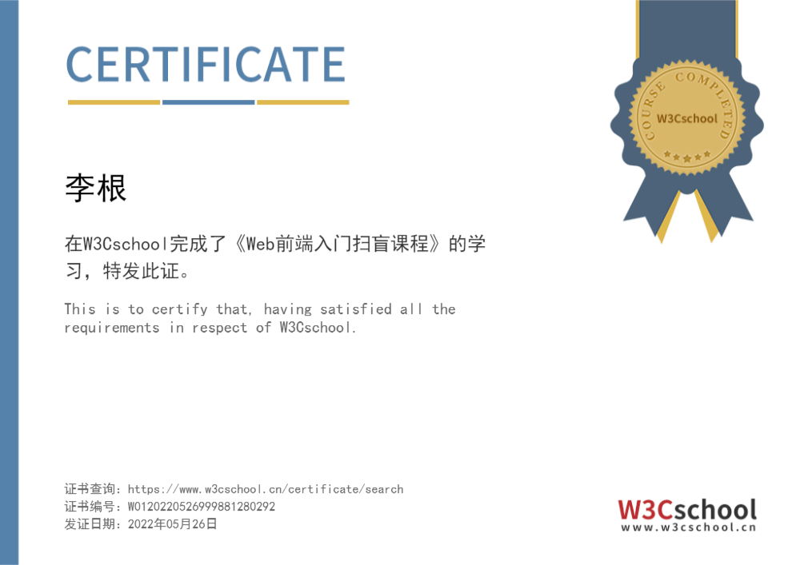
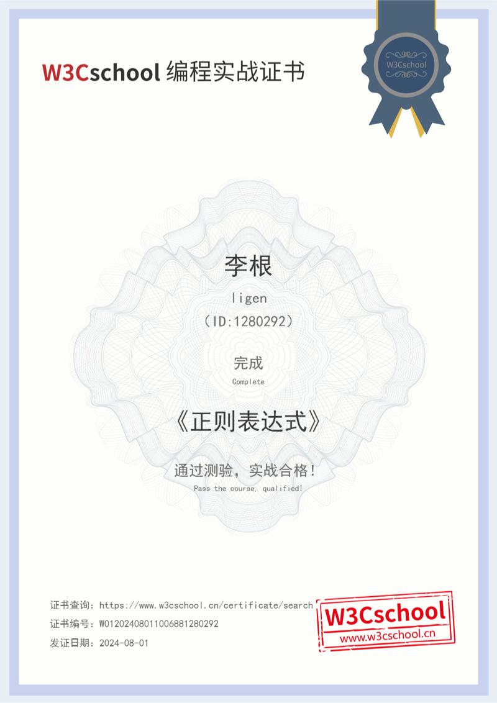
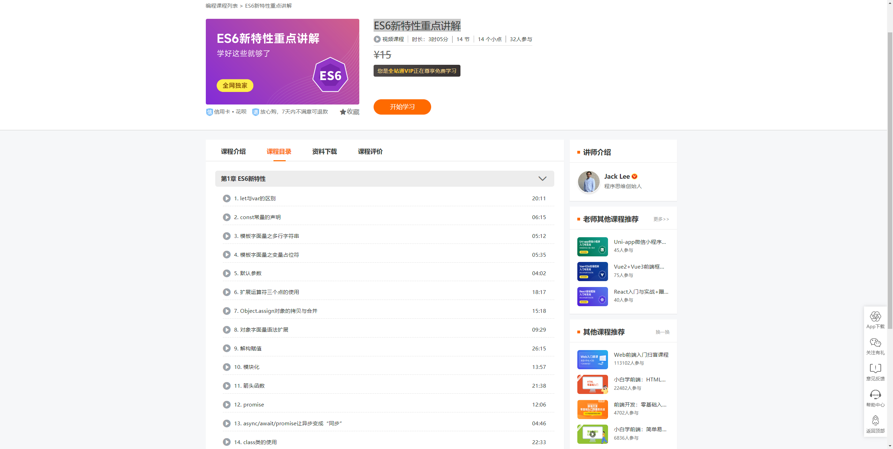
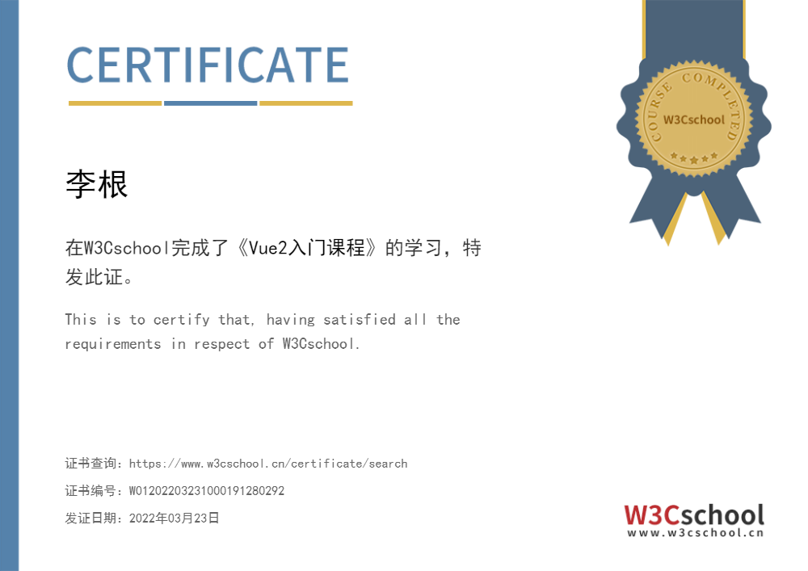
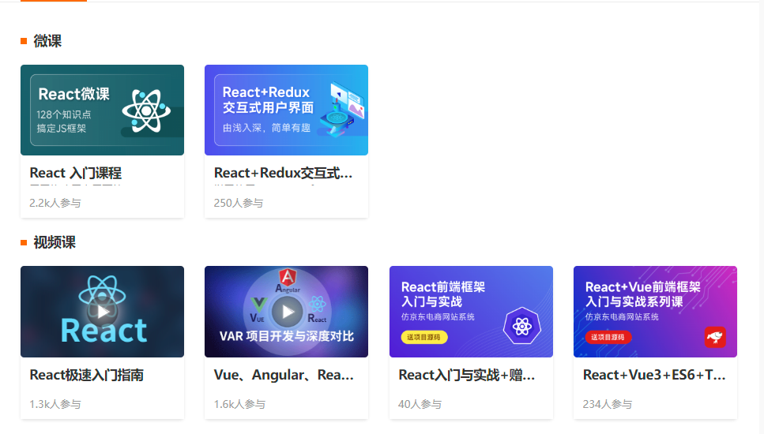
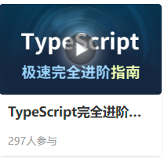

# My Awards

 

## 综合能力

### CSDN 工程师能力

    
    

        <h3>
          <b>Award Title：</b>
          <a target="_blank"  href='https://ks.csdn.net/'>C1-见习工程师能力认证（CSDN）</a>
        </h3>
        

          <b>Award Platform：</b>
          <a target="_blank"  href='https://ks.csdn.net/'>CSDN</a>
        

        

          <b>Status：</b>
          Done
        

        

          <b>Date：</b>
          2023-05-17
        

        

          <b>Course Link：</b>
          <a target="_blank"  href='https://ac.csdn.net/c1outline.html'>https://ac.csdn.net/c1outline.html</a>
        

        

          <b>Certificate NO.：</b>C1202201241643004194830126
        

    

  

  

### 鸿蒙原生移动应用开发

    
    

        <h3>
          <b>Award Title：</b>
          <a target="_blank"  href='https://www.xiaoqiqiao.com/university/#/1/3980577/certificateQuery'>鸿蒙原生移动应用开发学习合格证</a>
        </h3>
        

          <b>Award Platform：</b>
          <a target="_blank"  href='https://www.xiaoqiqiao.com/university/#/1/3980577/certificateQuery'>深圳市职业技能提升公益性培训</a>
        

        

          <b>Status：</b>
          Done
        

        

          <b>Course Link：</b>
          <a target="_blank"  href='https://www.xiaoqiqiao.com/university/#/1/3980577/certificateQuery'>https://www.xiaoqiqiao.com/university/#/1/3980577/certificateQuery</a>
        

        

          <b>Date：</b>2024-12
        

        

          <b>Certificate NO.：</b>GY20240505000895
        

    

  

  

### 编程入门相关

    
    

        <h3>
          <b>Award Title：</b>
          <a target="_blank"  href=''>《热门编程语言应用前景》课程认证书</a>
        </h3>
        

          <b>Award Platform：</b>
          <a target="_blank"  href='https://www.w3cschool.cn/'>W3Cschool</a>
        

        

          <b>Status：</b>
          Done
        

        

          <b>Date：</b>2025-01-09
        

        

          <b>Course Link：</b>
          
        

        

          <b>Certificate NO.：</b>
        

    

  

  

    
    

        <h3>
          <b>Award Title：</b>
          <a target="_blank"  href=''>《编程入门指南》课程认证</a>
        </h3>
        

          <b>Award Platform：</b>
          <a target="_blank"  href='https://www.w3cschool.cn/'>W3Cschool</a>
        

        

          <b>Status：</b>
          Done
        

        

          <b>Date：</b>
        

        

          <b>Course Link：</b>
          
        

        

          <b>Certificate NO.：</b>
        

    

  

  

    
    

        <h3>
          <b>Award Title：</b>
          <a target="_blank"  href=''>《基础网络协议入门课程》认证书</a>
        </h3>
        

          <b>Award Platform：</b>
          <a target="_blank"  href='https://www.w3cschool.cn/'>W3Cschool</a>
        

        

          <b>Status：</b>
          Done
        

        

          <b>Date：</b>
        

        

          <b>Course Link：</b>
          
        

        

          <b>Certificate NO.：</b>
        

    

  

  

## Web 前端开发

### HTML + CSS (包含HTML5 + CSS3)

    
    

        <h3>
          <b>Award Title：</b>
          <a target="_blank"  href=''>《HTML入门课程（含HTML5）》认证书</a>
        </h3>
        

          <b>Award Platform：</b>
          <a target="_blank"  href='https://www.w3cschool.cn/'>W3Cschool</a>
        

        

          <b>Status：</b>
          Done
        

        

          <b>Date：</b>
        

        

          <b>Course Link：</b>
          
        

        

          <b>Certificate NO.：</b>
        

    

  

  

    
    

        <h3>
          <b>Award Title：</b>
          <a target="_blank"  href=''>《HTML5 新特性实战》编程实战证书</a>
        </h3>
        

          <b>Award Platform：</b>
          <a target="_blank"  href='https://www.w3cschool.cn/'>W3Cschool</a>
        

        

          <b>Status：</b>
          Done
        

        

          <b>Date：</b>
        

        

          <b>Course Link：</b>
          
        

        

          <b>Certificate NO.：</b>
        

    

  

  

    
    

        <h3>
          <b>Award Title：</b>
          <a target="_blank"  href="">《HTML + CSS 基础实战》编程实战证书</a>
        </h3>
        

          <b>Award Platform：</b>
          <a target="_blank"  href='https://www.w3cschool.cn/'>W3Cschool</a>
        

        

          <b>Status：</b>
          Done
        

        

          <b>Date：</b>
        

        

          <b>Course Link：</b>
          
        

        

          <b>Certificate NO.：</b>
        

    

  

  

    
    

        <h3>
          <b>Award Title：</b>
          <a target="_blank"  href="">《HTML + CSS 进阶实战》编程实战证书</a>
        </h3>
        

          <b>Award Platform：</b>
          <a target="_blank"  href='https://www.w3cschool.cn/'>W3Cschool</a>
        

        

          <b>Status：</b>
          Done
        

        

          <b>Date：</b>
        

        

          <b>Course Link：</b>
          
        

        

          <b>Certificate NO.：</b>
        

    

  

  

    
    

        <h3>
          <b>Award Title：</b>
          <a target="_blank"  href="">《CSS3 flex 布局实战》编程实战证书</a>
        </h3>
        

          <b>Award Platform：</b>
          <a target="_blank"  href='https://www.w3cschool.cn/'>W3Cschool</a>
        

        

          <b>Status：</b>
          Done
        

        

          <b>Date：</b>
        

        

          <b>Course Link：</b>
          
        

        

          <b>Certificate NO.：</b>
        

    

  

  

    
    

        <h3>
          <b>Award Title：</b>
          <a target="_blank"  href="">《CSS3 网格布局》编程实战证书</a>
        </h3>
        

          <b>Award Platform：</b>
          <a target="_blank"  href='https://www.w3cschool.cn/'>W3Cschool</a>
        

        

          <b>Status：</b>
          Done
        

        

          <b>Date：</b>
        

        

          <b>Course Link：</b>
          
        

        

          <b>Certificate NO.：</b>
        

    

  

  

    
    

        <h3>
          <b>Award Title：</b>
          <a target="_blank"  href="">《CSS 入门课程》课程认证</a>
        </h3>
        

          <b>Award Platform：</b>
          <a target="_blank"  href='https://www.w3cschool.cn/'>W3Cschool</a>
        

        

          <b>Status：</b>
          Done
        

        

          <b>Date：</b>
        

        

          <b>Course Link：</b>
          
        

        

          <b>Certificate NO.：</b>
        

    

  

  

    
    

        <h3>
          <b>Award Title：</b>
          <a target="_blank"  href="">《深入研究CSS文本换行》课程认证</a>
        </h3>
        

          <b>Award Platform：</b>
          <a target="_blank"  href='https://www.w3cschool.cn/'>W3Cschool</a>
        

        

          <b>Status：</b>
          Done
        

        

          <b>Date：</b>
        

        

          <b>Course Link：</b>
          
        

        

          <b>Certificate NO.：</b>
        

    

  

  

    
    

        <h3>
          <b>Award Title：</b>
          <a target="_blank"  href="">《彻底理解CSS Flexbox布局》课程认证</a>
        </h3>
        

          <b>Award Platform：</b>
          <a target="_blank"  href='https://www.w3cschool.cn/'>W3Cschool</a>
        

        

          <b>Status：</b>
          Done
        

        

          <b>Date：</b>
        

        

          <b>Course Link：</b>
          
        

        

          <b>Certificate NO.：</b>
        

    

  

  

### JavaScript

    
    

        <h3>
          <b>Award Title：</b>
          <a target="_blank"  href=''>《JavaScript 入门课程》认证书</a>
        </h3>
        

          <b>Award Platform：</b>
          <a target="_blank"  href='https://www.w3cschool.cn/'>W3Cschool</a>
        

        

          <b>Status：</b>
          Done
        

        

          <b>Date：</b>
        

        

          <b>Course Link：</b>
          
        

        

          <b>Certificate NO.：</b>
        

    

  

  

    
    

        <h3>
          <b>Award Title：</b>
          <a target="_blank"  href=''>《Web前端入门扫盲课程》认证书</a>
        </h3>
        

          <b>Award Platform：</b>
          <a target="_blank"  href='https://www.w3cschool.cn/'>W3Cschool</a>
        

        

          <b>Status：</b>
          Done
        

        

          <b>Date：</b>
        

        

          <b>Course Link：</b>
          
        

        

          <b>Certificate NO.：</b>
        

    

  

  

    
    

        <h3>
          <b>Award Title：</b>
          <a target="_blank"  href=''>17-《JavaScript 基础实战》编程实战证书</a>
        </h3>
        

          <b>Award Platform：</b>
          <a target="_blank"  href='https://www.w3cschool.cn/'>W3Cschool</a>
        

        

          <b>Status：</b>
          Done
        

        

          <b>Date：</b>
        

        

          <b>Course Link：</b>
          
        

        

          <b>Certificate NO.：</b>
        

    

  

  

    
    

        <h3>
          <b>Award Title：</b>
          <a target="_blank"  href=''>《JavaScript 函数式编程》编程实战证书</a>
        </h3>
        

          <b>Award Platform：</b>
          <a target="_blank"  href='https://www.w3cschool.cn/'>W3Cschool</a>
        

        

          <b>Status：</b>
          Done
        

        

          <b>Date：</b>
        

        

          <b>Course Link：</b>
          
        

        

          <b>Certificate NO.：</b>
        

    

  

  

    
    

        <h3>
          <b>Award Title：</b>
          <a target="_blank"  href=''>《JavaScript 基本数据结构》编程实战证书</a>
        </h3>
        

          <b>Award Platform：</b>
          <a target="_blank"  href='https://www.w3cschool.cn/'>W3Cschool</a>
        

        

          <b>Status：</b>
          Done
        

        

          <b>Date：</b>
        

        

          <b>Course Link：</b>
          
        

        

          <b>Certificate NO.：</b>
        

    

  

  

    
    

        <h3>
          <b>Award Title：</b>
          <a target="_blank"  href=''>《JavaScript 面向对象编程》编程实战证书</a>
        </h3>
        

          <b>Award Platform：</b>
          <a target="_blank"  href='https://www.w3cschool.cn/'>W3Cschool</a>
        

        

          <b>Status：</b>
          Done
        

        

          <b>Date：</b>
        

        

          <b>Course Link：</b>
          
        

        

          <b>Certificate NO.：</b>
        

    

  

  

    
    

        <h3>
          <b>Award Title：</b>
          <a target="_blank"  href=''>《正则表达式》编程实战证书</a>
        </h3>
        

          <b>Award Platform：</b>
          <a target="_blank"  href='https://www.w3cschool.cn/'>W3Cschool</a>
        

        

          <b>Status：</b>
          Done
        

        

          <b>Date：</b>
        

        

          <b>Course Link：</b>
          
        

        

          <b>Certificate NO.：</b>
        

    

  

  

    
    

        <h3>
          <b>Award Title：</b>
          
        </h3>
        

          <b>Award Platform：</b>
          <a target="_blank"  href='https://www.w3cschool.cn/'>W3Cschool</a>
        

        

          <b>Status：</b>
          Done
        

        

          <b>Date：</b>
        

        

          <b>Course Link：</b>
          
        

        

          <b>Certificate NO.：</b>
        

    

  

  

    
    

        <h3>
          <b>Award Title：</b>
          <a target="_blank"  href=''>《JavaScript 原生模块》课程认证书</a>
        </h3>
        

          <b>Award Platform：</b>
          <a target="_blank"  href='https://www.w3cschool.cn/'>W3Cschool</a>
        

        

          <b>Status：</b>
          Done
        

        

          <b>Date：</b>
        

        

          <b>Course Link：</b>
          
        

        

          <b>Certificate NO.：</b>
        

    

  

  

    
    

        <h3>
          <b>Award Title：</b>
          <a target="_blank"  href=''>《彻底理解JavaScript中的类型转换》课程认证书</a>
        </h3>
        

          <b>Award Platform：</b>
          <a target="_blank"  href='https://www.w3cschool.cn/'>W3Cschool</a>
        

        

          <b>Status：</b>
          Done
        

        

          <b>Date：</b>
        

        

          <b>Course Link：</b>
          
        

        

          <b>Certificate NO.：</b>
        

    

  

  

    
    

        <h3>
          <b>Award Title：</b>
          <a target="_blank"  href=''>《脚本算法编程实战课程》课程认证</a>
        </h3>
        

          <b>Award Platform：</b>
          <a target="_blank"  href='https://www.w3cschool.cn/'>W3Cschool</a>
        

        

          <b>Status：</b>
          To do
        

        

          <b>Date：</b>
        

        

          <b>Course Link：</b>
          
        

        

          <b>Certificate NO.：</b>
        

    

  

  

### JQuery

    
    

        <h3>
          <b>Award Title：</b>
          <a target="_blank"  href=''>《JQuery 入门课程》认证书</a>
        </h3>
        

          <b>Award Platform：</b>
          <a target="_blank"  href='https://www.w3cschool.cn/'>W3Cschool</a>
        

        

          <b>Status：</b>
          Done
        

        

          <b>Date：</b>
        

        

          <b>Course Link：</b>
          
        

        

          <b>Certificate NO.：</b>
        

    

  

  

    
    

        <h3>
          <b>Award Title：</b>
          <a target="_blank"  href="">《JQuery 入门实战》编程实战证书</a>
        </h3>
        

          <b>Award Platform：</b>
          <a target="_blank"  href='https://www.w3cschool.cn/'>W3Cschool</a>
        

        

          <b>Status：</b>
          Done
        

        

          <b>Date：</b>
        

        

          <b>Course Link：</b>
          
        

        

          <b>Certificate NO.：</b>
        

    

  

  

### Ajax + JSON

    
    

        <h3>
          <b>Award Title：</b>
          <a target="_blank"  href=''>《Ajax+ JSON入门课程》认证书</a>
        </h3>
        

          <b>Award Platform：</b>
          <a target="_blank"  href='https://www.w3cschool.cn/'>W3Cschool</a>
        

        

          <b>Status：</b>
          Done
        

        

          <b>Date：</b>
        

        

          <b>Course Link：</b>
          
        

        

          <b>Certificate NO.：</b>
        

    

  

  

### ES6

    
    

        <h3>
          <b>Award Title：</b>
          <a target="_blank"  href=''>《ES6 微课》认证书</a>
        </h3>
        

          <b>Award Platform：</b>
          <a target="_blank"  href='https://www.w3cschool.cn/'>W3Cschool</a>
        

        

          <b>Status：</b>
          Done
        

        

          <b>Date：</b>
        

        

          <b>Course Link：</b>
          
        

        

          <b>Certificate NO.：</b>
        

    

  

  

    
    

        <h3>
          <b>Award Title：</b>
          <a target="_blank"  href="">《ES6 入门课程》认证书</a>
        </h3>
        

          <b>Award Platform：</b>
          <a target="_blank"  href='https://www.w3cschool.cn/'>W3Cschool</a>
        

        

          <b>Status：</b>
          Done
        

        

          <b>Date：</b>
        

        

          <b>Course Link：</b>
          
        

        

          <b>Certificate NO.：</b>
        

    

  

  

    
    

        <h3>
          <b>Award Title：</b>
          <a target="_blank"  href="">《ES6新特性重点讲解》课程认证</a>
        </h3>
        

          <b>Award Platform：</b>
          <a target="_blank"  href='https://www.w3cschool.cn/'>W3Cschool</a>
        

        

          <b>Status：</b>
          To do
        

        

          <b>Date：</b>
        

        

          <b>Course Link：</b>
          
        

        

          <b>Certificate NO.：</b>
        

    

  

  

### Git + SVN

    
    

        <h3>
          <b>Award Title：</b>
          <a target="_blank"  href=''>《Git 基础课程》课程认证</a>
        </h3>
        

          <b>Award Platform：</b>
          <a target="_blank"  href='https://www.w3cschool.cn/'>W3Cschool</a>
        

        

          <b>Status：</b>
          Done
        

        

          <b>Date：</b>
        

        

          <b>Course Link：</b>
          
        

        

          <b>Certificate NO.：</b>
        

    

  

  

    
    

        <h3>
          <b>Award Title：</b>
          <a target="_blank"  href="">《1小时快速上手版本控制器SVN》课程认证</a>
        </h3>
        

          <b>Award Platform：</b>
          <a target="_blank"  href='https://www.w3cschool.cn/'>W3Cschool</a>
        

        

          <b>Status：</b>
          Done
        

        

          <b>Date：</b>
        

        

          <b>Course Link：</b>
          
        

        

          <b>Certificate NO.：</b>
        

    

  

  

    
    

        <h3>
          <b>Award Title：</b>
          <a target="_blank"  href="">《Git 快速入门体验课程》课程认证</a>
        </h3>
        

          <b>Award Platform：</b>
          <a target="_blank"  href='https://www.w3cschool.cn/'>W3Cschool</a>
        

        

          <b>Status：</b>
          Done
        

        

          <b>Date：</b>
        

        

          <b>Course Link：</b>
          
        

        

          <b>Certificate NO.：</b>
        

    

  

  

    
    

        <h3>
          <b>Award Title：</b>
          <a target="_blank"  href="">《Git 新手入门》课程认证</a>
        </h3>
        

          <b>Award Platform：</b>
          <a target="_blank"  href='https://www.w3cschool.cn/'>W3Cschool</a>
        

        

          <b>Status：</b>
          To do
        

        

          <b>Date：</b>
        

        

          <b>Course Link：</b>
          
        

        

          <b>Certificate NO.：</b>
        

    

  

  

### Vue

    
    

        <h3>
          <b>Award Title：</b>
          <a target="_blank"  href=''>《Vue2入门课程》认证书</a>
        </h3>
        

          <b>Award Platform：</b>
          <a target="_blank"  href='https://www.w3cschool.cn/'>W3Cschool</a>
        

        

          <b>Status：</b>
          Done
        

        

          <b>Date：</b>
        

        

          <b>Course Link：</b>
          
        

        

          <b>Certificate NO.：</b>
        

    

  

  

    
    

        <h3>
          <b>Award Title：</b>
          <a target="_blank"  href="">《Vue系列》课程认证</a>
        </h3>
        

          <b>Award Platform：</b>
          <a target="_blank"  href='https://www.w3cschool.cn/'>W3Cschool</a>
        

        

          <b>Status：</b>
          To do
        

        

          <b>Date：</b>
        

        

          <b>Course Link：</b>
          
        

        

          <b>Certificate NO.：</b>
        

    

  

  

### React

    
    

        <h3>
          <b>Award Title：</b>
          <a target="_blank"  href=''>《React 入门课程》认证书</a>
        </h3>
        

          <b>Award Platform：</b>
          <a target="_blank"  href='https://www.w3cschool.cn/'>W3Cschool</a>
        

        

          <b>Status：</b>
          Done
        

        

          <b>Date：</b>
        

        

          <b>Course Link：</b>
          
        

        

          <b>Certificate NO.：</b>
        

    

  

  

    
    

        <h3>
          <b>Award Title：</b>
          <a target="_blank"  href="">《React + Redux交互式用户界面》课程认证书</a>
        </h3>
        

          <b>Award Platform：</b>
          <a target="_blank"  href='https://www.w3cschool.cn/'>W3Cschool</a>
        

        

          <b>Status：</b>
          Done
        

        

          <b>Date：</b>
        

        

          <b>Course Link：</b>
          
        

        

          <b>Certificate NO.：</b>
        

    

  

  

    
    

        <h3>
          <b>Award Title：</b>
          <a target="_blank"  href="">《React系列》课程认</a>
        </h3>
        

          <b>Award Platform：</b>
          <a target="_blank"  href='https://www.w3cschool.cn/'>W3Cschool</a>
        

        

          <b>Status：</b>
          To do
        

        

          <b>Date：</b>
        

        

          <b>Course Link：</b>
          
        

        

          <b>Certificate NO.：</b>
        

    

  

  

### TypeScript

    
    

        <h3>
          <b>Award Title：</b>
          <a target="_blank"  href=''>《TypeScript 入门到进阶课程》认证书</a>
        </h3>
        

          <b>Award Platform：</b>
          <a target="_blank"  href='https://www.w3cschool.cn/'>W3Cschool</a>
        

        

          <b>Status：</b>
          Done
        

        

          <b>Date：</b>
        

        

          <b>Course Link：</b>
          
        

        

          <b>Certificate NO.：</b>
        

    

  

  

    
    

        <h3>
          <b>Award Title：</b>
          <a target="_blank"  href="">《TypeScript快速入门（通俗易懂）》认证</a>
        </h3>
        

          <b>Award Platform：</b>
          <a target="_blank"  href='https://www.w3cschool.cn/'>W3Cschool</a>
        

        

          <b>Status：</b>
          To do
        

        

          <b>Date：</b>
        

        

          <b>Course Link：</b>
          
        

        

          <b>Certificate NO.：</b>
        

    

  

  

    
    

        <h3>
          <b>Award Title：</b>
          <a target="_blank"  href="">《TypeScript完全进阶指南》课程认证</a>
        </h3>
        

          <b>Award Platform：</b>
          <a target="_blank"  href='https://www.w3cschool.cn/'>W3Cschool</a>
        

        

          <b>Status：</b>
          To do
        

        

          <b>Date：</b>
        

        

          <b>Course Link：</b>
          
        

        

          <b>Certificate NO.：</b>
        

    

  

  

### 微信小程序

    
    

        <h3>
          <b>Award Title：</b>
          <a target="_blank"  href=''>《微信小程序快速入门（2020版）》课程认证</a>
        </h3>
        

          <b>Award Platform：</b>
          <a target="_blank"  href='https://www.w3cschool.cn/'>W3Cschool</a>
        

        

          <b>Status：</b>
          To do
        

        

          <b>Date：</b>
        

        

          <b>Course Link：</b>
          
        

        

          <b>Certificate NO.：</b>
        

    

  

  

    
    

        <h3>
          <b>Award Title：</b>
          <a target="_blank"  href="">《微信小程序入门课程》课程认证书</a>
        </h3>
        

          <b>Award Platform：</b>
          <a target="_blank"  href='https://www.w3cschool.cn/'>W3Cschool</a>
        

        

          <b>Status：</b>
          To do
        

        

          <b>Date：</b>
        

        

          <b>Course Link：</b>
          
        

        

          <b>Certificate NO.：</b>
        

    

  

  

    
    

        <h3>
          <b>Award Title：</b>
          <a target="_blank"  href="">《微信小程序系列课程》课程认证</a>
        </h3>
        

          <b>Award Platform：</b>
          <a target="_blank"  href='https://www.w3cschool.cn/'>W3Cschool</a>
        

        

          <b>Status：</b>
          To do
        

        

          <b>Course Link：</b>
          
        

    

  

  

### Node.JS

    
    

        <h3>
          <b>Award Title：</b>
          <a target="_blank"  href=''>《Node.js 入门课程》课程认证书</a>
        </h3>
        

          <b>Award Platform：</b>
          <a target="_blank"  href='https://www.w3cschool.cn/'>W3Cschool</a>
        

        

          <b>Status：</b>
          To do
        

        

          <b>Date：</b>
        

        

          <b>Course Link：</b>
          
        

        

          <b>Certificate NO.：</b>
        

    

  

  

    
    

        <h3>
          <b>Award Title：</b>
          <a target="_blank"  href="">《Node.js 快速入门视频教程（通俗易懂）》课程认证</a>
        </h3>
        

          <b>Award Platform：</b>
          <a target="_blank"  href='https://www.w3cschool.cn/'>W3Cschool</a>
        

        

          <b>Status：</b>
          Done
        

        

          <b>Date：</b>
        

        

          <b>Course Link：</b>
          
        

        

          <b>Certificate NO.：</b>
        

    

  

  

### Updating

    
    

        <h3>
          <b>Award Title：</b>
          
        </h3>
        

          <b>Award Platform：</b>
          <a target="_blank"  href='https://www.w3cschool.cn/'>W3Cschool</a>
        

        

          <b>Status：</b>
          Done
        

        

          <b>Date：</b>
        

        

          <b>Course Link：</b>
          
        

        

          <b>Certificate NO.：</b>
        

    

  

  

    
    

        <h3>
          <b>Award Title：</b>
          
        </h3>
        

          <b>Award Platform：</b>
          <a target="_blank"  href='https://www.w3cschool.cn/'>W3Cschool</a>
        

        

          <b>Status：</b>
          Done
        

        

          <b>Date：</b>
        

        

          <b>Course Link：</b>
          
        

        

          <b>Certificate NO.：</b>
        

    

  

  
