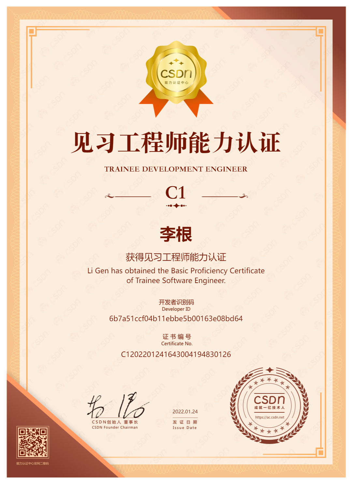

# My Awards

 

## 综合能力

### CSDN 工程师能力

    
    

        <h3>
          <b>Award Title：</b>
          <a target="_blank"  href='https://ks.csdn.net/'>C1-见习工程师能力认证（CSDN）</a>
        </h3>
        

          <b>Award Platform：</b>
          <a target="_blank"  href='https://ks.csdn.net/'>CSDN</a>
        

        

          <b>Status：</b>
          Done
        

        

          <b>Date：</b>
          2023-05-17
        

        

          <b>Course Link：</b>
          <a target="_blank"  href='https://ac.csdn.net/c1outline.html'>https://ac.csdn.net/c1outline.html</a>
        

        

          <b>Certificate NO.：</b>C1202201241643004194830126
        

    

  

  

### 鸿蒙原生移动应用开发

    
    

        <h3>
          <b>Award Title：</b>
          <a target="_blank"  href='https://www.xiaoqiqiao.com/university/#/1/3980577/certificateQuery'>鸿蒙原生移动应用开发学习合格证</a>
        </h3>
        

          <b>Award Platform：</b>
          <a target="_blank"  href='https://www.xiaoqiqiao.com/university/#/1/3980577/certificateQuery'>深圳市职业技能提升公益性培训</a>
        

        

          <b>Status：</b>
          Done
        

        

          <b>Course Link：</b>
          <a target="_blank"  href='https://www.xiaoqiqiao.com/university/#/1/3980577/certificateQuery'>https://www.xiaoqiqiao.com/university/#/1/3980577/certificateQuery</a>
        

        

          <b>Date：</b>2024-12
        

        

          <b>Certificate NO.：</b>GY20240505000895
        

    

  

  

### 编程入门相关
>
>- W3Cschool 平台证书查询：<a href="https://www.w3cschool.cn/certificate/search">https://www.w3cschool.cn/certificate/search</a>
>

    
    

        <h3>
          <b>Award Title：</b>
          <a target="_blank"  href='https://www.w3cschool.cn/minicourse/play/hotprogramming'>《热门编程语言应用前景》课程认证书</a>
        </h3>
        

          <b>Award Platform：</b>
          <a target="_blank"  href='https://www.w3cschool.cn/'>W3Cschool</a>
        

        

          <b>Status：</b>
          Done
        

        

          <b>Date：</b>2025-01-09
        

        

          <b>Course Link：</b>
          <a target="_blank"  href='https://www.w3cschool.cn/minicourse/play/hotprogramming'>https://www.w3cschool.cn/minicourse/play/hotprogramming</a>
        

        

          <b>Certificate NO.：</b>W01202501091005381280292
        

    

  

  

    
    

        <h3>
          <b>Award Title：</b>
          <a target="_blank"  href='https://www.w3cschool.cn/minicourse/play/zdhcm'>《编程入门指南》课程认证</a>
        </h3>
        

          <b>Award Platform：</b>
          <a target="_blank"  href='https://www.w3cschool.cn/'>W3Cschool</a>
        

        

          <b>Status：</b>
          Done
        

        

          <b>Date：</b>2025-01-09
        

        

          <b>Course Link：</b>
          <a target="_blank"  href='https://www.w3cschool.cn/minicourse/play/zdhcm'>https://www.w3cschool.cn/minicourse/play/zdhcm</a>
        

        

          <b>Certificate NO.：</b>W01202501091003851280292
        

    

  

  

    
    

        <h3>
          <b>Award Title：</b>
          <a target="_blank"  href='https://www.w3cschool.cn/minicourse/play/httptcpcourse'>《基础网络协议入门课程》认证</a>
        </h3>
        

          <b>Award Platform：</b>
          <a target="_blank"  href='https://www.w3cschool.cn/'>W3Cschool</a>
        

        

          <b>Status：</b>
          Done
        

        

          <b>Date：</b>2022
        

        

          <b>Course Link：</b>
          <a target="_blank"  href='https://www.w3cschool.cn/minicourse/play/httptcpcourse'>https://www.w3cschool.cn/minicourse/play/httptcpcourse</a>
        

        

          <b>Certificate NO.：</b>
        

    

  

  

## Web 前端开发

### HTML + CSS (包含HTML5 + CSS3)

    
    

        <h3>
          <b>Award Title：</b>
          <a target="_blank"  href='https://www.w3cschool.cn/minicourse/play/htmlcourse'>《HTML入门课程（含HTML5）》认证书</a>
        </h3>
        

          <b>Award Platform：</b>
          <a target="_blank"  href='https://www.w3cschool.cn/'>W3Cschool</a>
        

        

          <b>Status：</b>
          Done
        

        

          <b>Date：</b>2025-01-07
        

        

          <b>Course Link：</b>
          <a target="_blank"  href='https://www.w3cschool.cn/minicourse/play/htmlcourse'>https://www.w3cschool.cn/minicourse/play/htmlcourse</a>
        

        

          <b>Certificate NO.：</b>W0120250107568751280292
        

    

  

  

    
    

        <h3>
          <b>Award Title：</b>
          <a target="_blank"  href='https://www.w3cschool.cn/codecamp/newList/accessibility'>《HTML5 新特性实战》编程实战证书</a>
        </h3>
        

          <b>Award Platform：</b>
          <a target="_blank"  href='https://www.w3cschool.cn/'>W3Cschool</a>
        

        

          <b>Status：</b>
          Done
        

        

          <b>Date：</b>2021-05-29
        

        

          <b>Course Link：</b>
          <a target="_blank"  href='https://www.w3cschool.cn/codecamp/newList/accessibility'>https://www.w3cschool.cn/codecamp/newList/accessibility</a>
        

        

          <b>Certificate NO.：</b>W01202105291006681280292
        

    

  

  

    
    

        <h3>
          <b>Award Title：</b>
          <a target="_blank"  href="https://www.w3cschool.cn/codecamp/newList/basehtml">《HTML + CSS 基础实战》编程实战证书</a>
        </h3>
        

          <b>Award Platform：</b>
          <a target="_blank"  href='https://www.w3cschool.cn/'>W3Cschool</a>
        

        

          <b>Status：</b>
          Done
        

        

          <b>Date：</b>2023-03-24
        

        

          <b>Course Link：</b>
          <a target="_blank"  href='https://www.w3cschool.cn/codecamp/newList/basehtml'>https://www.w3cschool.cn/codecamp/newList/basehtml</a>
        

        

          <b>Certificate NO.：</b>W01202303241005881280292
        

    

  

  

    
    

        <h3>
          <b>Award Title：</b>
          <a target="_blank"  href="https://www.w3cschool.cn/codecamp/newList/csslevel2">《HTML + CSS 进阶实战》编程实战证书</a>
        </h3>
        

          <b>Award Platform：</b>
          <a target="_blank"  href='https://www.w3cschool.cn/'>W3Cschool</a>
        

        

          <b>Status：</b>
          Done
        

        

          <b>Date：</b>2021-05-16
        

        

          <b>Course Link：</b>
          <a target="_blank"  href='https://www.w3cschool.cn/codecamp/newList/csslevel2'>https://www.w3cschool.cn/codecamp/newList/csslevel2</a>
        

        

          <b>Certificate NO.：</b>W01202105161005981280292
        

    

  

  

    
    

        <h3>
          <b>Award Title：</b>
          <a target="_blank"  href="https://www.w3cschool.cn/codecamp/newList/css3flexbox">《CSS3 flex 布局实战》编程实战证书</a>
        </h3>
        

          <b>Award Platform：</b>
          <a target="_blank"  href='https://www.w3cschool.cn/'>W3Cschool</a>
        

        

          <b>Status：</b>
          Done
        

        

          <b>Date：</b>2021-05-07
        

        

          <b>Course Link：</b>
          <a target="_blank"  href='https://www.w3cschool.cn/codecamp/newList/css3flexbox'>https://www.w3cschool.cn/codecamp/newList/css3flexbox</a>
        

        

          <b>Certificate NO.：</b>W01202105071006711280292
        

    

  

  

    
    

        <h3>
          <b>Award Title：</b>
          <a target="_blank"  href="https://www.w3cschool.cn/codecamp/newList/cssgrid">《CSS3 Grid网格布局》编程实战证书</a>
        </h3>
        

          <b>Award Platform：</b>
          <a target="_blank"  href='https://www.w3cschool.cn/'>W3Cschool</a>
        

        

          <b>Status：</b>
          Done
        

        

          <b>Date：</b>2021-05-12
        

        

          <b>Course Link：</b>
          <a target="_blank"  href='https://www.w3cschool.cn/codecamp/newList/cssgrid'>https://www.w3cschool.cn/codecamp/newList/cssgrid</a>
        

        

          <b>Certificate NO.：</b>W01202105121006731280292
        

    

  

  

    
    

        <h3>
          <b>Award Title：</b>
          <a target="_blank"  href="https://www.w3cschool.cn/minicourse/play/csscourse">《CSS 入门课程》课程认证</a>
        </h3>
        

          <b>Award Platform：</b>
          <a target="_blank"  href='https://www.w3cschool.cn/'>W3Cschool</a>
        

        

          <b>Status：</b>
          Done
        

        

          <b>Date：</b>2025-01-13
        

        

          <b>Course Link：</b>
          <a target="_blank"  href='https://www.w3cschool.cn/minicourse/play/csscourse'>https://www.w3cschool.cn/minicourse/play/csscourse</a>
        

        

          <b>Certificate NO.：</b>W0120250113572221280292
        

    

  

  

    
    

        <h3>
          <b>Award Title：</b>
          <a target="_blank"  href="https://www.w3cschool.cn/minicourse/play/geosd">《深入研究CSS文本换行》课程认证</a>
        </h3>
        

          <b>Award Platform：</b>
          <a target="_blank"  href='https://www.w3cschool.cn/'>W3Cschool</a>
        

        

          <b>Status：</b>
          Done
        

        

          <b>Date：</b>2023
        

        

          <b>Course Link：</b>
          <a target="_blank"  href='https://www.w3cschool.cn/minicourse/play/geosd'>https://www.w3cschool.cn/minicourse/play/geosd</a>
        

        

          <b>Certificate NO.：</b>******
        

    

  

  

    
    

        <h3>
          <b>Award Title：</b>
          <a target="_blank"  href="https://www.w3cschool.cn/minicourse/play/jxqgp">《彻底理解CSS Flexbox布局》课程认证</a>
        </h3>
        

          <b>Award Platform：</b>
          <a target="_blank"  href='https://www.w3cschool.cn/'>W3Cschool</a>
        

        

          <b>Status：</b>
          Done
        

        

          <b>Date：</b>2023
        

        

          <b>Course Link：</b>
          <a target="_blank"  href='https://www.w3cschool.cn/minicourse/play/jxqgp'>https://www.w3cschool.cn/minicourse/play/jxqgp</a>
        

        

          <b>Certificate NO.：</b>******
        

    

  

  

### JavaScript

    
    

        <h3>
          <b>Award Title：</b>
          <a target="_blank"  href='https://www.w3cschool.cn/minicourse/play/jscourse'>《JavaScript 入门课程》认证书</a>
        </h3>
        

          <b>Award Platform：</b>
          <a target="_blank"  href='https://www.w3cschool.cn/'>W3Cschool</a>
        

        

          <b>Status：</b>
          Done
        

        

          <b>Date：</b>2025-01-07
        

        

          <b>Course Link：</b>
          <a target="_blank"  href='https://www.w3cschool.cn/minicourse/play/jscourse'>https://www.w3cschool.cn/minicourse/play/jscourse</a>
        

        

          <b>Certificate NO.：</b>W0120250107574211280292
        

    

  

  

    
    

        <h3>
          <b>Award Title：</b>
          <a target="_blank"  href='https://www.w3cschool.cn/minicourse/play/wsfnp'>《Web前端入门扫盲课程》认证书</a>
        </h3>
        

          <b>Award Platform：</b>
          <a target="_blank"  href='https://www.w3cschool.cn/'>W3Cschool</a>
        

        

          <b>Status：</b>
          Done
        

        

          <b>Date：</b>2022-05-26
        

        

          <b>Course Link：</b>
          <a target="_blank"  href='https://www.w3cschool.cn/minicourse/play/wsfnp'>https://www.w3cschool.cn/minicourse/play/wsfnp</a>
        

        

          <b>Certificate NO.：</b>W0120220526999881280292
        

    

  

  

    
    

        <h3>
          <b>Award Title：</b>
          <a target="_blank"  href='https://www.w3cschool.cn/codecamp/newList/javascriptbase'>《JavaScript 基础实战》编程实战证书</a>
        </h3>
        

          <b>Award Platform：</b>
          <a target="_blank"  href='https://www.w3cschool.cn/'>W3Cschool</a>
        

        

          <b>Status：</b>
          Done
        

        

          <b>Date：</b>2021-05-30
        

        

          <b>Course Link：</b>
          <a target="_blank"  href='https://www.w3cschool.cn/codecamp/newList/javascriptbase'>https://www.w3cschool.cn/codecamp/newList/javascriptbase</a>
        

        

          <b>Certificate NO.：</b>W01202105301006751280292
        

    

  

  

    
    

        <h3>
          <b>Award Title：</b>
          <a target="_blank"  href='https://www.w3cschool.cn/codecamp/newList/functional_programming'>《JavaScript 函数式编程》编程实战证书</a>
        </h3>
        

          <b>Award Platform：</b>
          <a target="_blank"  href='https://www.w3cschool.cn/'>W3Cschool</a>
        

        

          <b>Status：</b>
          Done
        

        

          <b>Date：</b>2024-07-30
        

        

          <b>Course Link：</b>
          <a target="_blank"  href='https://www.w3cschool.cn/codecamp/newList/functional_programming'>https://www.w3cschool.cn/codecamp/newList/functional_programming</a>
        

        

          <b>Certificate NO.：</b>W01202407301006981280292
        

    

  

  

    
    

        <h3>
          <b>Award Title：</b>
          <a target="_blank"  href='https://www.w3cschool.cn/codecamp/newList/basic_data_structures'>《JavaScript 基本数据结构》编程实战证书</a>
        </h3>
        

          <b>Award Platform：</b>
          <a target="_blank"  href='https://www.w3cschool.cn/'>W3Cschool</a>
        

        

          <b>Status：</b>
          Done
        

        

          <b>Date：</b>2021-08-03
        

        

          <b>Course Link：</b>
          <a target="_blank"  href='https://www.w3cschool.cn/codecamp/newList/basic_data_structures'>https://www.w3cschool.cn/codecamp/newList/basic_data_structures</a>
        

        

          <b>Certificate NO.：</b>W01202108031006931280292
        

    

  

  

    
    

        <h3>
          <b>Award Title：</b>
          <a target="_blank"  href='https://www.w3cschool.cn/codecamp/newList/object_oriented_programming'>《JavaScript 面向对象编程》编程实战证书</a>
        </h3>
        

          <b>Award Platform：</b>
          <a target="_blank"  href='https://www.w3cschool.cn/'>W3Cschool</a>
        

        

          <b>Status：</b>
          Done
        

        

          <b>Date：</b>2022-04-19
        

        

          <b>Course Link：</b>
          <a target="_blank"  href='https://www.w3cschool.cn/codecamp/newList/object_oriented_programming'>https://www.w3cschool.cn/codecamp/newList/object_oriented_programming</a>
        

        

          <b>Certificate NO.：</b>W01202204191006971280292
        

    

  

  

    
    

        <h3>
          <b>Award Title：</b>
          <a target="_blank"  href='https://www.w3cschool.cn/codecamp/newList/initreg'>《正则表达式》编程实战证书</a>
        </h3>
        

          <b>Award Platform：</b>
          <a target="_blank"  href='https://www.w3cschool.cn/'>W3Cschool</a>
        

        

          <b>Status：</b>
          Done
        

        

          <b>Date：</b>2024-08-01
        

        

          <b>Course Link：</b>
          <a target="_blank"  href='https://www.w3cschool.cn/codecamp/newList/initreg'>https://www.w3cschool.cn/codecamp/newList/initreg</a>
        

        

          <b>Certificate NO.：</b>W01202408011006881280292
        

    

  

  

    
    

        <h3>
          <b>Award Title：</b>
          <a target="_blank"  href='https://www.w3cschool.cn/minicourse/play/javascriptmodule'>《JavaScript 原生模块》课程认证书</a>
        </h3>
        

          <b>Award Platform：</b>
          <a target="_blank"  href='https://www.w3cschool.cn/'>W3Cschool</a>
        

        

          <b>Status：</b>
          Done
        

        

          <b>Date：</b>2023
        

        

          <b>Course Link：</b>
          <a target="_blank"  href='https://www.w3cschool.cn/minicourse/play/javascriptmodule'>https://www.w3cschool.cn/minicourse/play/javascriptmodule</a>
        

        

          <b>Certificate NO.：</b>******
        

    

  

  

    
    

        <h3>
          <b>Award Title：</b>
          <a target="_blank"  href='https://www.w3cschool.cn/minicourse/play/xafmc'>《彻底理解JavaScript中的类型转换》课程认证书</a>
        </h3>
        

          <b>Award Platform：</b>
          <a target="_blank"  href='https://www.w3cschool.cn/'>W3Cschool</a>
        

        

          <b>Status：</b>
          Done
        

        

          <b>Date：</b>2024
        

        

          <b>Course Link：</b>
          <a target="_blank"  href='https://www.w3cschool.cn/minicourse/play/xafmc'>https://www.w3cschool.cn/minicourse/play/xafmc</a>
        

        

          <b>Certificate NO.：</b>******
        

    

  

  

    
    

        <h3>
          <b>Award Title：</b>
          <a target="_blank"  href='https://www.w3cschool.cn/codecamp'>《脚本算法编程实战课程》课程认证</a>
        </h3>
        

          <b>Award Platform：</b>
          <a target="_blank"  href='https://www.w3cschool.cn/'>W3Cschool</a>
        

        

          <b>Status：</b>
          To do
        

        

          <b>Date：</b>2025
        

        

          <b>Course Link：</b>
          <a target="_blank"  href='https://www.w3cschool.cn/codecamp'>https://www.w3cschool.cn/codecamp</a>
        

        

          <b>Certificate NO.：</b>******
        

    

  

  

### JQuery

    
    

        <h3>
          <b>Award Title：</b>
          <a target="_blank"  href='https://www.w3cschool.cn/minicourse/play/jquerycourse'>《JQuery 入门课程》认证书</a>
        </h3>
        

          <b>Award Platform：</b>
          <a target="_blank"  href='https://www.w3cschool.cn/'>W3Cschool</a>
        

        

          <b>Status：</b>
          Done
        

        

          <b>Date：</b>2022-02-24
        

        

          <b>Course Link：</b>
          <a target="_blank"  href='https://www.w3cschool.cn/minicourse/play/jquerycourse'>https://www.w3cschool.cn/minicourse/play/jquerycourse</a>
        

        

          <b>Certificate NO.：</b>W0120220224574161280292
        

    

  

  

    
    

        <h3>
          <b>Award Title：</b>
          <a target="_blank"  href="https://www.w3cschool.cn/codecamp/newList/jquery_learn">《JQuery 入门实战》编程实战证书</a>
        </h3>
        

          <b>Award Platform：</b>
          <a target="_blank"  href='https://www.w3cschool.cn/'>W3Cschool</a>
        

        

          <b>Status：</b>
          Done
        

        

          <b>Date：</b>2021-05-18
        

        

          <b>Course Link：</b>
          <a target="_blank"  href='https://www.w3cschool.cn/codecamp/newList/jquery_learn'>https://www.w3cschool.cn/codecamp/newList/jquery_learn</a>
        

        

          <b>Certificate NO.：</b>W01202105181007031280292
        

    

  

  

### Ajax + JSON

    
    

        <h3>
          <b>Award Title：</b>
          <a target="_blank"  href='https://www.w3cschool.cn/minicourse/play/ajaxcourse'>《Ajax+ JSON入门课程》认证书</a>
        </h3>
        

          <b>Award Platform：</b>
          <a target="_blank"  href='https://www.w3cschool.cn/'>W3Cschool</a>
        

        

          <b>Status：</b>
          Done
        

        

          <b>Date：</b>2021-07-26
        

        

          <b>Course Link：</b>
          <a target="_blank"  href='https://www.w3cschool.cn/minicourse/play/ajaxcourse'>https://www.w3cschool.cn/minicourse/play/ajaxcourse</a>
        

        

          <b>Certificate NO.：</b>W0120210726662261280292
        

    

  

  

### ES6

    
    

        <h3>
          <b>Award Title：</b>
          <a target="_blank"  href='https://www.w3cschool.cn/minicourse/play/ecmascript6'>《ES6 微课》认证书</a>
        </h3>
        

          <b>Award Platform：</b>
          <a target="_blank"  href='https://www.w3cschool.cn/'>W3Cschool</a>
        

        

          <b>Status：</b>
          Done
        

        

          <b>Date：</b>2022-01-30
        

        

          <b>Course Link：</b>
          <a target="_blank"  href='https://www.w3cschool.cn/minicourse/play/ecmascript6'>https://www.w3cschool.cn/minicourse/play/ecmascript6</a>
        

        

          <b>Certificate NO.：</b>W01202201301002211280292
        

    

  

  

    
    

        <h3>
          <b>Award Title：</b>
          <a target="_blank"  href="https://www.w3cschool.cn/minicourse/play/ecmascript6">《ES6 入门课程》认证书</a>
        </h3>
        

          <b>Award Platform：</b>
          <a target="_blank"  href='https://www.w3cschool.cn/'>W3Cschool</a>
        

        

          <b>Status：</b>
          Done
        

        

          <b>Date：</b>2022-01-30
        

        

          <b>Course Link：</b>
          <a target="_blank"  href='https://www.w3cschool.cn/minicourse/play/ecmascript6'>https://www.w3cschool.cn/minicourse/play/ecmascript6</a>
        

        

          <b>Certificate NO.：</b>W01202201301002211280292
        

    

  

  

    
    

        <h3>
          <b>Award Title：</b>
          <a target="_blank"  href="https://www.w3cschool.cn/minicourse/play/es6_mblxxy">《ES6 从入门到精通》课程认证书</a>
        </h3>
        

          <b>Award Platform：</b>
          <a target="_blank"  href='https://www.w3cschool.cn/'>W3Cschool</a>
        

        

          <b>Status：</b>
          Done
        

        

          <b>Date：</b>2022-01-30
        

        

          <b>Course Link：</b>
          <a target="_blank"  href='https://www.w3cschool.cn/minicourse/play/es6_mblxxy'>https://www.w3cschool.cn/minicourse/play/es6_mblxxy</a>
        

        

          <b>Certificate NO.：</b>******
        

    

  

  

    
    

        <h3>
          <b>Award Title：</b>
          <a target="_blank"  href="https://www.w3cschool.cn/minicourse/play/lucklnk_es6">《ES6新特性重点讲解》课程认证</a>
        </h3>
        

          <b>Award Platform：</b>
          <a target="_blank"  href='https://www.w3cschool.cn/'>W3Cschool</a>
        

        

          <b>Status：</b>
          To do
        

        

          <b>Date：</b>2025
        

        

          <b>Course Link：</b>
          <a target="_blank"  href='https://www.w3cschool.cn/minicourse/play/lucklnk_es6'>https://www.w3cschool.cn/minicourse/play/lucklnk_es6</a>
        

        

          <b>Certificate NO.：</b>******
        

    

  

  

### Git + SVN

    
    

        <h3>
          <b>Award Title：</b>
          <a target="_blank"  href='https://www.w3cschool.cn/minicourse/play/gitcourse'>《Git 基础课程》课程认证</a>
        </h3>
        

          <b>Award Platform：</b>
          <a target="_blank"  href='https://www.w3cschool.cn/'>W3Cschool</a>
        

        

          <b>Status：</b>
          Done
        

        

          <b>Date：</b>2024
        

        

          <b>Course Link：</b>
          <a target="_blank"  href='https://www.w3cschool.cn/minicourse/play/gitcourse'>https://www.w3cschool.cn/minicourse/play/gitcourse</a>
        

        

          <b>Certificate NO.：</b>W0120230317654561280292
        

    

  

  

    
    

        <h3>
          <b>Award Title：</b>
          <a target="_blank"  href="https://www.w3cschool.cn/minicourse/play/svn_my">《1小时快速上手版本控制器SVN》课程认证</a>
        </h3>
        

          <b>Award Platform：</b>
          <a target="_blank"  href='https://www.w3cschool.cn/'>W3Cschool</a>
        

        

          <b>Status：</b>
          Done
        

        

          <b>Date：</b>2023
        

        

          <b>Course Link：</b>
          <a target="_blank"  href='https://www.w3cschool.cn/minicourse/play/svn_my'>https://www.w3cschool.cn/minicourse/play/svn_my</a>
        

        

          <b>Certificate NO.：</b>******
        

    

  

  

    
    

        <h3>
          <b>Award Title：</b>
          <a target="_blank"  href="https://www.w3cschool.cn/minicourse/play/xpjsw">《Git 快速入门体验课程》课程认证</a>
        </h3>
        

          <b>Award Platform：</b>
          <a target="_blank"  href='https://www.w3cschool.cn/'>W3Cschool</a>
        

        

          <b>Status：</b>
          Done
        

        

          <b>Date：</b>2023
        

        

          <b>Course Link：</b>
          <a target="_blank"  href='https://www.w3cschool.cn/minicourse/play/xpjsw'>https://www.w3cschool.cn/minicourse/play/xpjsw</a>
        

        

          <b>Certificate NO.：</b>******
        

    

  

  

    
    

        <h3>
          <b>Award Title：</b>
          <a target="_blank"  href="https://www.w3cschool.cn/minicourse/play/git_mblx">《Git 新手入门》课程认证</a>
        </h3>
        

          <b>Award Platform：</b>
          <a target="_blank"  href='https://www.w3cschool.cn/'>W3Cschool</a>
        

        

          <b>Status：</b>
          To do
        

        

          <b>Date：</b>2025
        

        

          <b>Course Link：</b>
          <a target="_blank"  href='https://www.w3cschool.cn/minicourse/play/git_mblx'>https://www.w3cschool.cn/minicourse/play/git_mblx</a>
        

        

          <b>Certificate NO.：</b>******
        

    

  

  

### Vue

    
    

        <h3>
          <b>Award Title：</b>
          <a target="_blank"  href='https://www.w3cschool.cn/minicourse/play/vuecourse'>《Vue2入门课程》认证书</a>
        </h3>
        

          <b>Award Platform：</b>
          <a target="_blank"  href='https://www.w3cschool.cn/'>W3Cschool</a>
        

        

          <b>Status：</b>
          Done
        

        

          <b>Date：</b>2022-03-23
        

        

          <b>Course Link：</b>
          <a target="_blank"  href='https://www.w3cschool.cn/minicourse/play/vuecourse'>https://www.w3cschool.cn/minicourse/play/vuecourse</a>
        

        

          <b>Certificate NO.：</b>W01202203231000191280292
        

    

  

  

    
    

        <h3>
          <b>Award Title：</b>
          <a target="_blank"  href="https://www.w3cschool.cn/search?target=content&w=vue">《Vue系列》课程认证</a>
        </h3>
        

          <b>Award Platform：</b>
          <a target="_blank"  href='https://www.w3cschool.cn/'>W3Cschool</a>
        

        

          <b>Status：</b>
          To do
        

        

          <b>Date：</b>2025
        

        

          <b>Course Link：</b>
          <a target="_blank"  href='https://www.w3cschool.cn/search?target=content&w=vue'>https://www.w3cschool.cn/search?target=content&w=vue</a>
        

        

          <b>Certificate NO.：</b>******
        

    

  

  

### React

    
    

        <h3>
          <b>Award Title：</b>
          <a target="_blank"  href='https://www.w3cschool.cn/minicourse/play/puybn'>《React 入门课程》认证书</a>
        </h3>
        

          <b>Award Platform：</b>
          <a target="_blank"  href='https://www.w3cschool.cn/'>W3Cschool</a>
        

        

          <b>Status：</b>
          Done
        

        

          <b>Date：</b>2023-03-23
        

        

          <b>Course Link：</b>
          <a target="_blank"  href='https://www.w3cschool.cn/minicourse/play/puybn'>https://www.w3cschool.cn/minicourse/play/puybn</a>
        

        

          <b>Certificate NO.：</b>W0120230323998981280292
        

    

  

  

    
    

        <h3>
          <b>Award Title：</b>
          <a target="_blank"  href="https://www.w3cschool.cn/minicourse/play/reactaredux">《React + Redux交互式用户界面》课程认证书</a>
        </h3>
        

          <b>Award Platform：</b>
          <a target="_blank"  href='https://www.w3cschool.cn/'>W3Cschool</a>
        

        

          <b>Status：</b>
          Done
        

        

          <b>Date：</b>2024-11
        

        

          <b>Course Link：</b>
          <a target="_blank"  href='https://www.w3cschool.cn/minicourse/play/reactaredux'>https://www.w3cschool.cn/minicourse/play/reactaredux</a>
        

        

          <b>Certificate NO.：</b>******
        

    

  

  

    
    

        <h3>
          <b>Award Title：</b>
          <a target="_blank"  href="https://www.w3cschool.cn/search?target=content&w=react">《React系列》课程认证</a>
        </h3>
        

          <b>Award Platform：</b>
          <a target="_blank"  href='https://www.w3cschool.cn/'>W3Cschool</a>
        

        

          <b>Status：</b>
          To do
        

        

          <b>Date：</b>2025
        

        

          <b>Course Link：</b>
          <a target="_blank"  href='https://www.w3cschool.cn/search?target=content&w=react'>https://www.w3cschool.cn/search?target=content&w=react</a>
        

        

          <b>Certificate NO.：</b>******
        

    

  

  

### TypeScript

    
    

        <h3>
          <b>Award Title：</b>
          <a target="_blank"  href='https://www.w3cschool.cn/minicourse/play/tsminicourse'>《TypeScript 入门到进阶课程》认证书</a>
        </h3>
        

          <b>Award Platform：</b>
          <a target="_blank"  href='https://www.w3cschool.cn/'>W3Cschool</a>
        

        

          <b>Status：</b>
          Done
        

        

          <b>Date：</b>2023-05-12
        

        

          <b>Course Link：</b>
          <a target="_blank"  href='https://www.w3cschool.cn/minicourse/play/tsminicourse'>https://www.w3cschool.cn/minicourse/play/tsminicourse</a>
        

        

          <b>Certificate NO.：</b>W0120230512852731280292
        

    

  

  

    
    

        <h3>
          <b>Award Title：</b>
          <a target="_blank"  href="https://www.w3cschool.cn/minicourse/play/txyts2020">《TypeScript快速入门（通俗易懂）》课程认证</a>
        </h3>
        

          <b>Award Platform：</b>
          <a target="_blank"  href='https://www.w3cschool.cn/'>W3Cschool</a>
        

        

          <b>Status：</b>
          To do
        

        

          <b>Date：</b>2025-**-**
        

        

          <b>Course Link：</b>
          <a target="_blank"  href='https://www.w3cschool.cn/minicourse/play/txyts2020'>https://www.w3cschool.cn/minicourse/play/txyts2020</a>
        

        

          <b>Certificate NO.：</b>******
        

    

  

  

    
    

        <h3>
          <b>Award Title：</b>
          <a target="_blank"  href="https://www.w3cschool.cn/minicourse/play/typescript_mblx">《TypeScript完全进阶指南》课程认证</a>
        </h3>
        

          <b>Award Platform：</b>
          <a target="_blank"  href='https://www.w3cschool.cn/'>W3Cschool</a>
        

        

          <b>Status：</b>
          To do
        

        

          <b>Date：</b>2025-**-**
        

        

          <b>Course Link：</b>
          <a target="_blank"  href='https://www.w3cschool.cn/minicourse/play/typescript_mblx'>https://www.w3cschool.cn/minicourse/play/typescript_mblx</a>
        

        

          <b>Certificate NO.：</b>******
        

    

  

  

### 微信小程序

    
    

        <h3>
          <b>Award Title：</b>
          <a target="_blank"  href='https://www.w3cschool.cn/minicourse/play/txywxxcx'>《微信小程序快速入门（2020版）》课程认证</a>
        </h3>
        

          <b>Award Platform：</b>
          <a target="_blank"  href='https://www.w3cschool.cn/'>W3Cschool</a>
        

        

          <b>Status：</b>
          To do
        

        

          <b>Date：</b>2025-**-**
        

        

          <b>Course Link：</b>
          <a target="_blank"  href='https://www.w3cschool.cn/minicourse/play/txywxxcx'>https://www.w3cschool.cn/minicourse/play/txywxxcx</a>
        

        

          <b>Certificate NO.：</b>******
        

    

  

  

    
    

        <h3>
          <b>Award Title：</b>
          <a target="_blank"  href="https://www.w3cschool.cn/minicourse/play/wxadoccourse">《微信小程序入门课程》课程认证书</a>
        </h3>
        

          <b>Award Platform：</b>
          <a target="_blank"  href='https://www.w3cschool.cn/'>W3Cschool</a>
        

        

          <b>Status：</b>
          To do
        

        

          <b>Date：</b>2025-**-**
        

        

          <b>Course Link：</b>
          <a target="_blank"  href='https://www.w3cschool.cn/minicourse/play/wxadoccourse'>https://www.w3cschool.cn/minicourse/play/wxadoccourse</a>
        

        

          <b>Certificate NO.：</b>******
        

    

  

  

    
    

        <h3>
          <b>Award Title：</b>
          <a target="_blank"  href="https://www.w3cschool.cn/search?target=content&w=%E5%BE%AE%E4%BF%A1%E5%B0%8F%E7%A8%8B%E5%BA%8F">《微信小程序系列课程》课程认证</a>
        </h3>
        

          <b>Award Platform：</b>
          <a target="_blank"  href='https://www.w3cschool.cn/'>W3Cschool</a>
        

        

          <b>Status：</b>
          To do
        

        

          <b>Course Link：</b>
          <a target="_blank"  href='https://www.w3cschool.cn/search?target=content&w=%E5%BE%AE%E4%BF%A1%E5%B0%8F%E7%A8%8B%E5%BA%8F'>https://www.w3cschool.cn/search?target=content&w=%E5%BE%AE%E4%BF%A1%E5%B0%8F%E7%A8%8B%E5%BA%8F</a>
        

    

  

  

### Node.JS

    
    

        <h3>
          <b>Award Title：</b>
          <a target="_blank"  href='https://www.w3cschool.cn/minicourse/play/orbls'>《Node.js 入门课程》课程认证书</a>
        </h3>
        

          <b>Award Platform：</b>
          <a target="_blank"  href='https://www.w3cschool.cn/'>W3Cschool</a>
        

        

          <b>Status：</b>
          To do
        

        

          <b>Date：</b>2025-**-**
        

        

          <b>Course Link：</b>
          <a target="_blank"  href='https://www.w3cschool.cn/minicourse/play/orbls'>https://www.w3cschool.cn/minicourse/play/orbls</a>
        

        

          <b>Certificate NO.：</b>******
        

    

  

  

    
    

        <h3>
          <b>Award Title：</b>
          <a target="_blank"  href="https://www.w3cschool.cn/minicourse/play/txynodejs">《Node.js 快速入门视频教程（通俗易懂）》课程认证</a>
        </h3>
        

          <b>Award Platform：</b>
          <a target="_blank"  href='https://www.w3cschool.cn/'>W3Cschool</a>
        

        

          <b>Status：</b>
          Done
        

        

          <b>Date：</b>2025-**-**
        

        

          <b>Course Link：</b>
          <a target="_blank"  href='https://www.w3cschool.cn/minicourse/play/txynodejs'>https://www.w3cschool.cn/minicourse/play/txynodejs</a>
        

        

          <b>Certificate NO.：</b>******
        

    

  

  

### Updating 待更新
> 待更新：
>- Element UI
>- Ant Design
>- Vite
>- Next.js
>- Remix.js
>- ......

    
    

        <h3>
          <b>Award Title：</b>
          
        </h3>
        

          <b>Award Platform：</b>
          <a target="_blank"  href='https://www.w3cschool.cn/'>W3Cschool</a>
        

        

          <b>Status：</b>
          Done
        

        

          <b>Date：</b>
        

        

          <b>Course Link：</b>
          
        

        

          <b>Certificate NO.：</b>
        

    

  

  

    
    

        <h3>
          <b>Award Title：</b>
          
        </h3>
        

          <b>Award Platform：</b>
          <a target="_blank"  href='https://www.w3cschool.cn/'>W3Cschool</a>
        

        

          <b>Status：</b>
          Done
        

        

          <b>Date：</b>
        

        

          <b>Course Link：</b>
          
        

        

          <b>Certificate NO.：</b>
        

    

  

  
